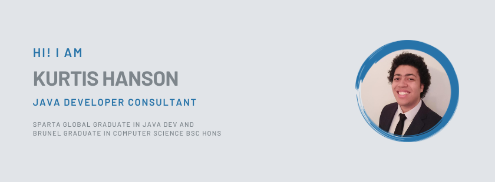

### Hi! Kurtis here 👋

---

  

😬 I am a **`Developer Consultant`** ⌨️ who has recently completed a 12-week training course with Sparta Global ⚔️ in **`Java Development`**.

🔎 Seeking work as a Junior Software Developer. 🤞

😍 My passion for programming began when I took computing in sixth form, upon the recommendation of GCSE ICT teacher who thought I would enjoy (she got that right). Since then it has continued to grow, a means for me to express my creativity and collaborate with others.

🔭 I'm currently refactoring recent projects I've completed with sparta, specifically [**`Guess That Quote`**][guess-that-quote] and [**`Press-Play`**][press-play] (pinned below)

🌱 I'm currently learning Spring Boot MVC and git version control. Check out my latest group project [**`one-to-one feedback tracker`**][1-to-1]

🤓 I want to learn web frameworks such as `React` and `Angular` to incorporate with `Java Spring`

👯 I'm looking to collaborate on a `React` project once I have done some learning

🤔 I'm looking for help with `Spring MVC` and `MySQL` database deployment, allowing usage to others but protecting sensitive data

🙋‍♂️ Ask me about **OOP**, **SOLID**, **SCRUM** and any other tech-related stuff!

### ⚡ Fun fact

> "Every 60 Seconds In Africa, A Minute Passes"         
> &ndash; [_Jamal, 2014_][jamal]

  

---

### Skills & Tools 🔨

         

### Other Languages I know 💬

   

---

### Some Cheeky Stats 📈

---

### Check me out here 🔌

[][linkedin]
[][twitter]
[][mail]
[][codersrank]
[][instagram]

---

🤝 Get in touch so that we can make something great! 💪

⭐️ Go give my repos and ✨ _star_ ✨ if you feel they're worth it! 💁‍♀️

<!-- footnote links -->

[linkedin]: https://www.linkedin.com/in/kxrtiswithak/
[twitter]: https://twitter.com/kxrtiswithak
[instagram]: https://www.instagram.com/kxrtiswithak
[mail]:mailto:kxrtiswithak@gmail.com
[codersrank]: https://profile.codersrank.io/user/kxrtiswithak
[guess-that-quote]: https://github.com/kxrtiswithak/GuessThatQuote
[press-play]: https://github.com/kxrtiswithak/Press-Play
[1-to-1]: https://github.com/kxrtiswithak/Engineering80FinalProject
[jamal]: https://www.youtube.com/watch?v=7Zm1hPbmzPw

<!-- template comment -->

<!--
**kxrtiswithak/kxrtiswithak** is a ✨ _special_ ✨ repository because its `README.md` (this file) appears on your GitHub profile.

Here are some ideas to get you started:

- 🔭 I’m currently working on ...
- 🌱 I’m currently learning ...
- 👯 I’m looking to collaborate on ...
- 🤔 I’m looking for help with ...
- 💬 Ask me about ...
- 📫 How to reach me: ...
- 😄 Pronouns: ...
- ⚡ Fun fact: ...
-->
